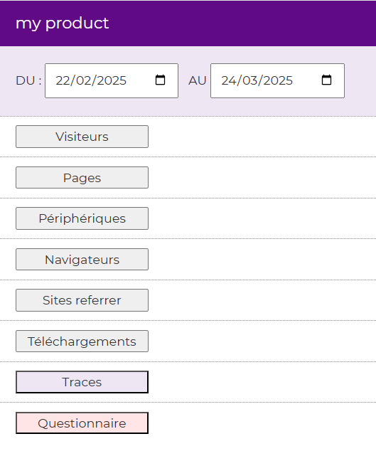
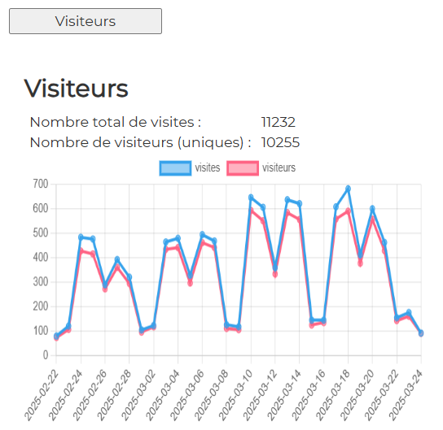
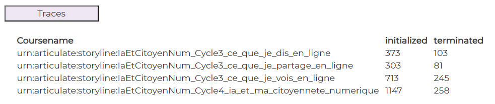
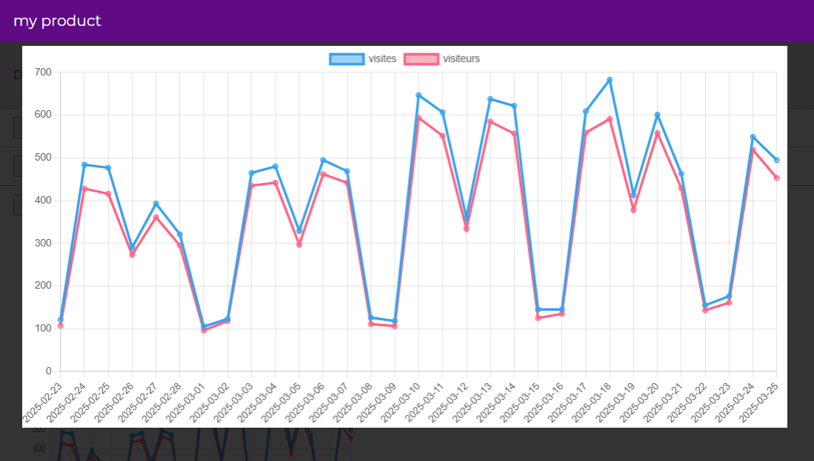

# Impact measurement tools

## Overview

This project is a collection of scripts to retrieve and display impact data:
- analytics
- learning traces
- surveys

It is structured in two parts :
- the front version ("app" folder)
- examples of data supply files in php, whether for analytics, traces or surveys ("php" folder)

## Context

You will find two preliminary documents:
- a state-of-the-art of impact measurement solutions (in french)<br>
\>\> [2.3.1-Etat-de-l-art-des-solutions-de-mesure-impact.pdf](./docs/2.3.1-Etat-de-l-art-des-solutions-de-mesure-impact.pdf)


- specifications (in french)<br>
  \>\> [2.3.2-Cahier-des-charges-Impact.pdf](./docs/2.3.2-Cahier-des-charges-Impact.pdf)

## Front tools

This is how the dashboard appears :



And some examples of tools deployed :


<br><br>

<br><br>

By clicking on the graph, you see it in full screen :


<br><br>
## How to Build

To build the projet, you can use the following command:

```bash
npm run build
```
## How to Run / Install

As this project is a front tool, it can be installed on any server :

```
app/
├── index.html
└── confs/
    └── config.json              🔴 # config file
└── dist/
    ├── main.js
    └── modules/
        ├── analytics.js
        ├── config.js
        ├── interface.js
        ├── lrs-component.js
        ├── survey-component.js
        ├── utils.js
        └── zoom.js
└── assets/
    └── fonts/
        ├── your-font.ttf
        └── another-of-your-font.ttf
    └── imgs/
        └── waif.gif
└── css/
    └── index.css
└── html-components/             🔵 # front proposition, customizable
    ├── browsers.html
    ├── devices.html
    ├── downloads.html
    ├── lrs01.html
    ├── pages.html
    ├── referrers.html
    ├── survey01.html
    └── visitors.html

```

## How to customize

To adapt the projet, you have to modify the config.json file.

The main structure is :

```jsonc
		{
			"product_title" 		: "",             // resource name
			"typeXXX": [                              // type of indicator 
				{
					"html"		: "",                 // "html" reference
					"dom_id"	: "",                 // depends on "html" reference
					"button"	: "",                 // depends on "html" reference
					"url"		: "https://data-url", // data source
					"result": {                       // 3 types : "chart" or "texts" or "table"
						"chart": {
						    "display"	: true,
							"type"		: "line",      // type of chart : "line" or "pie"
							"dom_id"	: "",          // depends on "html" reference
							"data_array": {
								"source" 	: "",      // depends on data source
								"labels"	: "",      // depends on data source
								"datasets"	: [        // depends on data source
									{
										"data": "",
										"legend": ""
									}
								]
							}

						},
						"texts": [
							{
							    "display"	: false,
								"dom_id"	: "",     // depends on "html" reference
								"data"		: ""      // depends on data source
							}
						],
						"table":
						{
						    "display"	: true,
							"dom_id"	: "",
							"source" 	: "",
							"data_array": [
							]						
						}
					}
				}
			]
		}
```


| param        | description                                                                                                                                                                                                                                                                                                                                                                 |
|--------------|-----------------------------------------------------------------------------------------------------------------------------------------------------------------------------------------------------------------------------------------------------------------------------------------------------------------------------------------------------------------------------|
| typeXXX      | either "analytics" or "lrs" or "surveys"                                                                                                                                                                                                                                                                                                                                    |
| html         | front module according to the type of indicator : <br/> "./html-components/visitors.html"<br/>  "./html-components/pages.html"<br/> "./html-components/browsers.html"<br/> "./html-components/devices.html"<br/> "./html-components/referrers.html"<br/> "./html-components/downloads.html"<br/> "./html-components/lrsXX.html"<br/> "./html-components/surveyXX.html"<br/> |
| dom_id       | for instance "visitors" for "./html-components/visitors.html"                                                                                                                                                                                                                                                                                                               |
| button       | for instance "btnVisitors" for "./html-components/visitors.html"                                                                                                                                                                                                                                                                                                            |
| url          | for instance, with php files of test : "https://my-domain/php/getUsers.php"                                                                                                                                                                                                                                                                                                 |
| result       | 3 properties "chart", "texts", "table". You can indicate if they are displayed or not                                                                                                                                                                                                                                                                                       |
|

More details for each type of indicator are given here \>\> [config.json](./docs/conf-app/CONFIG.md)


## Php demo files

If your server is running php, you can connect the app with demo data provider services.

They are based on :
* matomo
* learning locker
* lime survey

More details for each type of indicator are given here \>\> [demo php files](./docs/demo-php/CONFIG-PHP.md)

