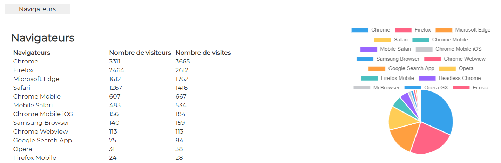

# Browsers

## Display

  

## file : html-components/browsers.html

The DOM important elements are :

| id                 | role                  |  
|--------------------|-----------------------|
| btnBrowsers        | button                |
| container-browsers | main container        |
| tablebrowsers      | the table of browsers |
| chartPie-browsers  | the result chart      |

## file : php/getBrowsers.php

The input GET params :

See \>\> [CONFIG-PHP.md](../demo-php/CONFIG-PHP.md)

The output json result is :

| variable          | role                              |  
|-------------------|-----------------------------------|
| matomo_browsers   | array of objects for each browser |
| ->matomo_browser  | -> the browser                    |
| ->matomo_users    | -> number of visitors             |
| ->matomo_visits   | -> number of visits               |

## file : confs/config.json

| param                                 | explanation                                                              |  
|---------------------------------------|--------------------------------------------------------------------------|
| dom_id                                | to be concatenated with "container-"   in analytics-component.ts     |
| display                               | true or false                                                            |
| html                                  | the path to html-file                                                    |
| button                                | click event defined in analytics-component.ts->prepareAnalyticsComponent |
| url                                   | the endpoint to get data                                                 |
| result                                | object                                                                   |
| ->chart->display                      | true                                                             |
| ->chart->type                         | "pie" // "line" or "pie"                                                 |
| ->chart->dom_id                       | "chartPie-browsers"                                                      |
| ->chart->data_array                   | object to feed the chart                                                 |
| ->chart->data_array->source           | php json->matomo_browsers                                                 |
| ->chart->data_array->label            | php json->matomo_browsers->matomo_browser                                  |
| ->chart->data_array->datasets         | array of as many objects as needed                                       |
| ->chart->data_array->datasets->data   | php json->matomo_browsers->matomo_users                                   |
| ->chart->data_array->datasets->legend | text to be displayed as a legend. For instance "Navigateurs"           |
| ->texts                               | unused                                                                   |
| ->table                               | object                                                                   |
| ->table->display                      | true                                                             |
| ->table->dom_id                       | html DOM element : "tablebrowsers"                                        |
| ->table->source                       | php json property : json->matomo_browsers                                 |
| ->table->data_array                   | object to feed the table                                                 |
| ->table->data_array->data             | php json property. For instance json->matomo_browsers->matomo_users       |
| ->table->data_array->legend           | text to be displayed as a legend. For instance "Nombre de visiteurs"     |

---

## Other docs

### general presentation
\>\> [overview](../../README.md)

### config.json
\>\> [config.json](../conf-app/CONFIG.md)

### demo php files
\>\> [CONFIG-PHP.md](../demo-php/CONFIG-PHP.md)

