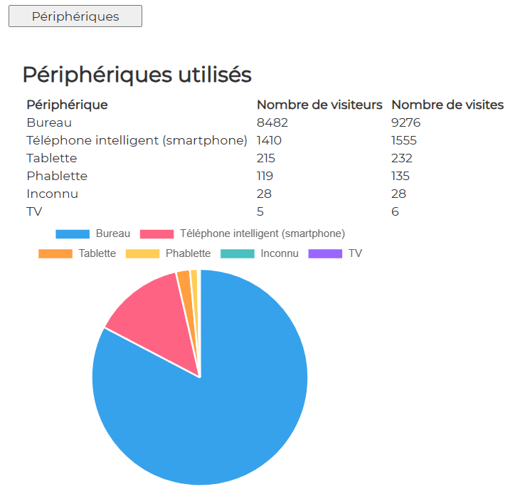

# Devices

## Display

  

## file : html-components/devices.html

The DOM important elements are :

| id                | role                 |  
|-------------------|----------------------|
| btnDevices        | button               |
| container-devices | main container       |
| tabledevices      | the table of devices |
| chartPie-devices  | the result chart     |

## file : php/getDevices.php

The input GET params :

See \>\> [CONFIG-PHP.md](../demo-php/CONFIG-PHP.md)

The output json result is :

| variable               | role                             |  
|------------------------|----------------------------------|
| matomo_devices         | array of objects for each device |
| ->matomo_device        | -> the device                    |
| ->matomo_users         | -> number of visitors            |
| ->matomo_visits        | -> number of visits              |

## file : confs/config.json

| param                                 | explanation                                                              |  
|---------------------------------------|--------------------------------------------------------------------------|
| dom_id                                | to be concatenated with "container-"   in analytics-component.ts     |
| display                               | true or false                                                            |
| html                                  | the path to html-file                                                    |
| button                                | click event defined in analytics-component.ts->prepareAnalyticsComponent |
| url                                   | the endpoint to get data                                                 |
| result                                | object                                                                   |
| ->chart->display                      | true                                                            |
| ->chart->type                         | "pie" // "line" or "pie"                                                 |
| ->chart->dom_id                       | "chartPie-devices"                                                   |
| ->chart->data_array                   | object to feed the chart                                                 |
| ->chart->data_array->source           | php json->matomo_devices                                                 |
| ->chart->data_array->label            | php json->matomo_devices->matomo_device                                  |
| ->chart->data_array->datasets         | array of as many objects as needed                                       |
| ->chart->data_array->datasets->data   | php json->matomo_devices->matomo_users                                   |
| ->chart->data_array->datasets->legend | text to be displayed as a legend. For instance "Périphériques"           |
| ->texts                               | unused                                                                   |
| ->table                               | object                                                                   |
| ->table->display                      | true                                                            |
| ->table->dom_id                       | html DOM element : "tabledevices"                                        |
| ->table->source                       | php json property : json->matomo_devices                                 |
| ->table->data_array                   | object to feed the table                                                 |
| ->table->data_array->data             | php json property. For instance json->matomo_devices->matomo_users       |
| ->table->data_array->legend           | text to be displayed as a legend. For instance "Nombre de visiteurs"     |

---

## Other docs

### general presentation
\>\> [overview](../../README.md)

### config.json
\>\> [config.json](../conf-app/CONFIG.md)

### demo php files
\>\> [CONFIG-PHP.md](../demo-php/CONFIG-PHP.md)

