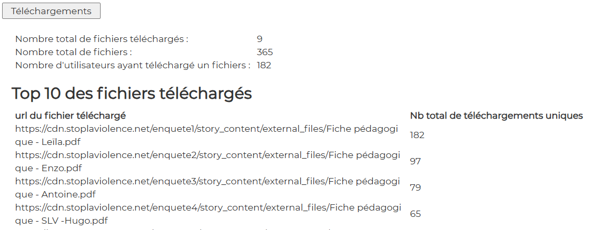

# Downloads

## Display

  

## file : html-components/downloads.html

The DOM important elements are :

| id                  | role                           |  
|---------------------|--------------------------------|
| btnDownloads        | button                         |
| container-downloads | main container                 |
| nbDownloadFiles     | the total number of downloads  |
| nbUsersFiles        | the total number of users      |
| tabledownloads      | the table of top 10 downloads  |

## file : php/getDownloads.php

The input GET params :

See \>\> [CONFIG-PHP.md](../demo-php/CONFIG-PHP.md)

The output json result is :

| variable                     | role                             |  
|------------------------------|----------------------------------|
| matomo_totaldownload         | number of total downloads        |
| matomo_visitorswithdownloads | number of total visitors         |
| ->matomo_page                | -> the page                      |
| ->matomo_nbvisits            | -> number of visits for the page |
| ->matomo_nbhits              | -> number of hits for the page   |

## file : confs/config.json

| param                       | explanation                                                                |  
|-----------------------------|----------------------------------------------------------------------------|
| dom_id                      | to be concatenated with "container-"   in analytics-component.ts       |
| display                     | true or false                                                              |
| html                        | the path to html-file                                                      |
| button                      | click event defined in analytics-component.ts->prepareAnalyticsComponent   |
| url                         | the endpoint to get data                                                   |
| result                      | object                                                                     |
| ->chart                     | unused                                                                     |
| ->texts                     | array of as many objects as needed                                         |
| ->texts->dom_id             | html DOM element. For instance "nbDownloadFiles"                           |
| ->texts->data               | php json property. For instance json->matomo_filesdownloaded               |
| ->table                     | object                                                                     |
| ->table->display            | true                                                                       |
| ->table->dom_id             | html DOM element : "tabledownloads"                                        |
| ->table->source             | php json property : json->matomo_downloadslist                             |
| ->table->data_array         | object to feed the table                                                   |
| ->table->data_array->data   | php json property. For instance json->matomo_downloadslist->matomo_page    |
| ->table->data_array->legend | text to be displayed as a legend. For instance "url du fichier téléchargé" |

---

## Other docs

### general presentation
\>\> [overview](../../README.md)

### config.json
\>\> [config.json](../conf-app/CONFIG.md)

### demo php files
\>\> [CONFIG-PHP.md](../demo-php/CONFIG-PHP.md)

