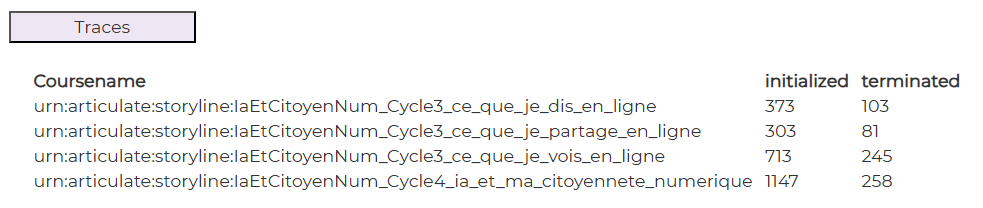

# Downloads

## Display

  

## file : html-components/lrsXX.html

You can have as many html files as traces. 
The only thing you have to do is to put a number like "01" in the filename and in DOM elements inside.

The DOM important elements are :

| id              | role                            |  
|-----------------|---------------------------------|
| btnlrsXX        | button (XX = "01" for instance) |
| container-lrsXX | main container                  |
| tablelrsXX      | the table of traces             |

## file : php/getLRS.php

The input GET params :

See \>\> [CONFIG-PHP.md](../demo-php/CONFIG-PHP.md)

The output json result is :

| variable   | role               |  
|------------|--------------------|
| lrs_traces | object of traces   |
| ->name     | userId             |
| ->{verb}   | -> 1 for each verb |
| page       | current page       |

## file : confs/config.json

| param                       | explanation                                                              |  
|-----------------------------|--------------------------------------------------------------------------|
| dom_id                      | to be concatenated with "container-"   in analytics-component.ts     |
| label                       | the label of the traces                                                  |
| display                     | true or false                                                            |
| html                        | the path to html-file                                                    |
| button                      | click event defined in analytics-component.ts->prepareAnalyticsComponent |
| product_index_lrs           | in case of several LRS sources (cf. /php/params.config.php)              |
| coursename                  | to filter LRS request (cf. /php/getLRS.php)                              |
| verbs                       | list of interesting verbs separated by a comma                           |
| limit_by_request            | maximum number of results (to avoid massive data)                        |
| url                         | the endpoint to get data                                                 |
| result                      | object                                                                   |
| ->chart                     | unused                                                                   |
| ->texts                     | unused                                                                   |
| ->table                     | object                                                                   |
| ->table->display            | true                                                                     |
| ->table->dom_id             | html DOM element : "tablelrXX"                                           |
| ->table->source             | php json property : json->lrs_traces                                     |

---

## Other docs

### general presentation
\>\> [overview](../../README.md)

### config.json
\>\> [config.json](../conf-app/CONFIG.md)

### demo php files
\>\> [CONFIG-PHP.md](../demo-php/CONFIG-PHP.md)

