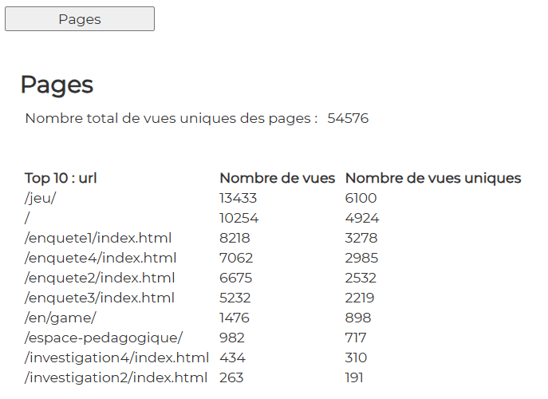

# Pages

## Display

  

## file : html-components/pages.html

The DOM important elements are :

| id              | role                      |  
|-----------------|---------------------------|
| btnPages        | button                    |
| container-pages | main container            |
| nbTotalViews    | the total visits          |
| tabletoppages   | the table of top 10 pages |

## file : php/getPages.php

The input GET params :

See \>\> [CONFIG-PHP.md](../demo-php/CONFIG-PHP.md)

The output json result is :

| variable                | role                              |  
|-------------------------|-----------------------------------|
| matomo_nbPagesViews     | number of total visits            |
| matomo_nbTotalViews     | number of total unique visits     |
| matomo_top10pages       | array of objects for top 10 pages |
| ->matomo_page           | -> the page                       |
| ->matomo_nbvisits       | -> number of visits for the page  |
| ->matomo_nbhits         | -> number of hits for the page    |

## file : confs/config.json

| param                       | explanation                                                              |  
|-----------------------------|--------------------------------------------------------------------------|
| dom_id                      | to be concatenated with "container-"   in analytics-component.ts     |
| display                     | true or false                                                            |
| html                        | the path to html-file                                                    |
| button                      | click event defined in analytics-component.ts->prepareAnalyticsComponent |
| url                         | the endpoint to get data                                                 |
| result                      | object                                                                   |
| ->chart                     | unused                                                                   |
| ->texts                     | array of as many objects as needed                                       |
| ->texts->dom_id             | html DOM element. For instance "nbTotalViews"                            |
| ->texts->data               | php json property. For instance json->matomo_nbTotalViews                |
| ->table                     | object                                                                   |
| ->table->display            | true                                                            |
| ->table->dom_id             | html DOM element : "tabletoppages"                                       |
| ->table->source             | php json property : json->matomo_top10pages                              |
| ->table->data_array         | object to feed the table                                                 |
| ->table->data_array->data   | php json property. For instance json->matomo_top10pages->matomo_page     |
| ->table->data_array->legend | text to be displayed as a legend. For instance "Top 10 : url"            |

---

## Other docs

### general presentation
\>\> [overview](../../README.md)

### config.json
\>\> [config.json](../conf-app/CONFIG.md)

### demo php files
\>\> [CONFIG-PHP.md](../demo-php/CONFIG-PHP.md)

