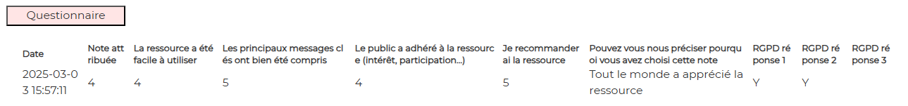

# Survey

## Display

<br><br>

## file : html-components/surveyXX.html

You can have as many html files as surveys.<br>
The only thing you have to do is to put a number like "01" in the filename and in DOM elements inside.

The DOM important elements are :

| id                  | role                            |  
|---------------------|---------------------------------|
| btnsurveyXX         | button (XX = "01" for instance) |
| container-surveyXX  | main container                  |
| tablesurveyXX       | the table of surveys            |

## file : php/getSurveys.php

The input GET params :

See \>\> [CONFIG-PHP.md](../demo-php/CONFIG-PHP.md)

The output json result is the limesurvey format
For instance : 
````
 {
      "id": 2,
      "submitdate": "2025-03-03 15:57:11",
      "lastpage": 1,
      "startlanguage": "fr",
      "seed": "455080895",
      "startdate": "2025-03-03 15:56:44",
      "datestamp": "2025-03-03 15:57:10",
      "Q00": "AO02",
      "G01Q04[SQ001]": "AO01",
      "G01Q02": "voici ma réponse",
      "G01Q03[SQ001]": "Y",
      "G01Q03[SQ002]": "Y",
      "G01Q03[SQ003]": ""
    }
````

## file : confs/config.json

| param                       | explanation                                                              |  
|-----------------------------|--------------------------------------------------------------------------|
| dom_id                      | to be concatenated with "container-" <br/> in analytics-component.ts     |
| label                       | the label of the traces                                                  |
| display                     | true or false                                                            |
| html                        | the path to html-file                                                    |
| button                      | click event defined in analytics-component.ts->prepareAnalyticsComponent |
| survey_index_user           | in case of several Surveys identities  (cf. /php/params.config.php)      |
| survey_id                   | lime survey id                                                           |
| url                         | the endpoint to get data                                                 |
| result                      | object                                                                   |
| ->chart                     | unused                                                                   |
| ->texts                     | unused                                                                   |
| ->table                     | object                                                                   |
| ->table->display            | true                                                                     |
| ->table->dom_id             | html DOM element : "tablesurveyXX"                                       |
| ->table->source             | php json property : json->responses                                      |
| ->table->data_array         | object to feed the table                                                 |
| ->table->data_array->data   | php json property. For instance json->submitdate                         |
| ->table->data_array->legend | text to be displayed as a legend. For instance "Date"                    |

---

## Other docs

### general presentation
\>\> [overview](../../README.md)

### config.json
\>\> [config.json](../conf-app/CONFIG.md)

### demo php files
\>\> [CONFIG-PHP.md](../demo-php/CONFIG-PHP.md)

