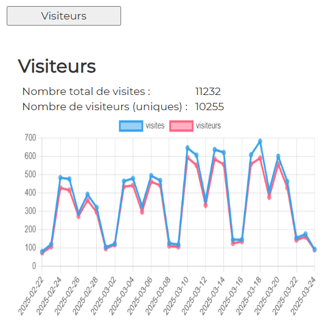
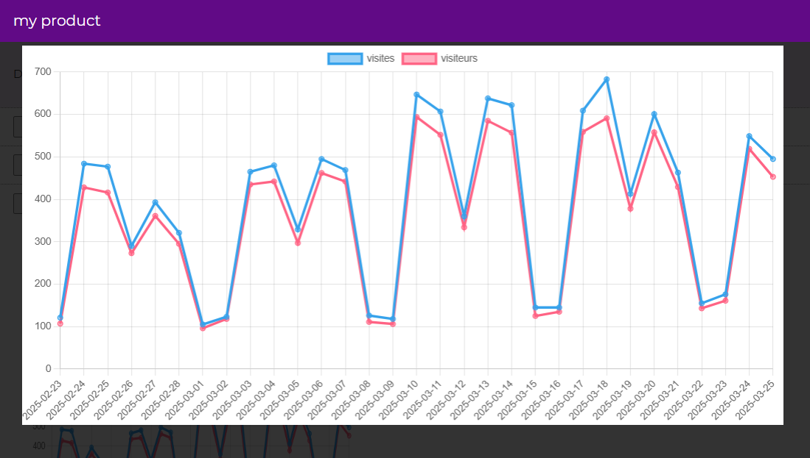

# Visitors

## Display

  

By clicking on the graph, you see it in full screen : 

  

## file : html-components/visitors.html

The DOM important elements are :

| id                  | role             |  
|---------------------|------------------|
| btnVisitors         | button           |
| container-visitors  | main container   |
| nbTotalVisits       | the total visits |
| nbTotalUniques      | uniques visits   |
| chartLines-visitors | the result chart |

## file : php/getUsers.php

The input GET params :

See \>\> [CONFIG-PHP.md](../demo-php/CONFIG-PHP.md)

The output json result is :

| variable                    | role                                   |  
|-----------------------------|----------------------------------------|
| matomo_nbTotalVisits        | number of total visits                 |
| matomo_nbTotalVisitsUniques | number of total unique visits          |
| matomo_arrayVisitsDay       | array of objects for each day          |
| ->matomo_day                | -> the day                             |
| ->matomo_nb_visits          | -> number of visits for the day        |
| ->matomo_nb_uniq_visitors   | -> number of unique visits for the day |

## file : confs/config.json

| param                                 | explanation                                                                                                    |  
|---------------------------------------|----------------------------------------------------------------------------------------------------------------|
| dom_id                                | to be concatenated with "container-"   in analytics-component.ts                                           |
| display                               | true or false                                                                                                  |
| html                                  | the path to html-file                                                                                          |
| button                                | click event defined in analytics-component.ts->prepareAnalyticsComponent                                       |
| url                                   | the endpoint to get data                                                                                       |
| result                                | object                                                                                                         |
| ->chart->display                      | true // true or false                                                                                          |
| ->chart->type                         | "line" // "line" or "pie"                                                                                      |
| ->chart->dom_id                       | "chartLines-visitors"                                                                                          |
| ->chart->data_array                   | object to feed the chart                                                                                       |
| ->chart->data_array->source           | php json->matomo_arrayVisitsDay                                                                                |
| ->chart->data_array->label            | php json->matomo_arrayVisitsDay->matomo_day                                                                    |
| ->chart->data_array->datasets         | array of as many objects as needed                                                                             |
| ->chart->data_array->datasets->data   | php json->matomo_arrayVisitsDay->matomo_nb_visits   or json->matomo_arrayVisitsDay->matomo_nb_uniq_visitors |
| ->chart->data_array->datasets->legend | text to be displayed as a legend. For instance "visites"                                                       |
| ->texts                               | array of as many objects as needed                                                                             |
| ->texts->dom_id                       | html DOM element. For instance "nbTotalVisits"                                                                 |
| ->texts->data                         | php json property. For instance json->matomo_nbTotalVisits                                                     |
| ->table                               | unused                                                                                                         |

---

## Other docs

### general presentation
\>\> [overview](../../README.md)

### config.json
\>\> [config.json](../conf-app/CONFIG.md)

### demo php files
\>\> [CONFIG-PHP.md](../demo-php/CONFIG-PHP.md)
